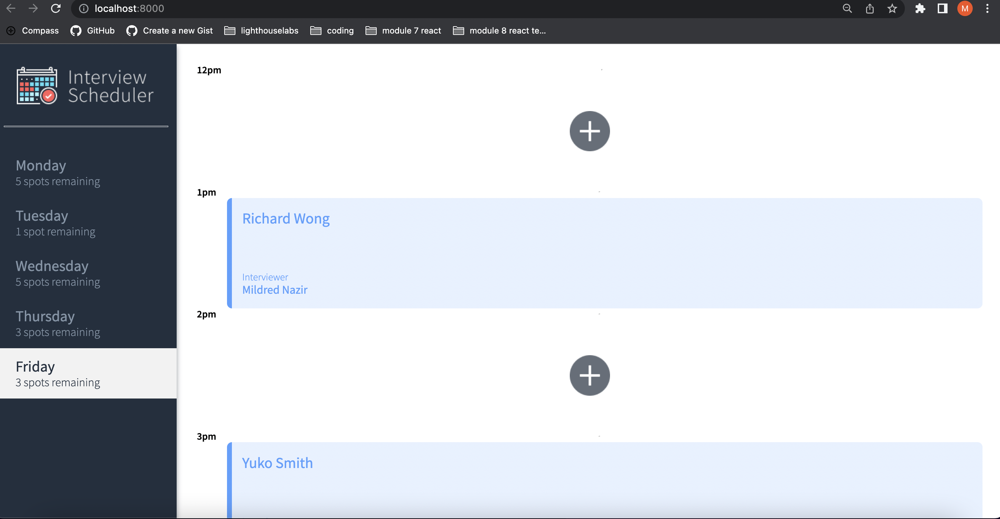
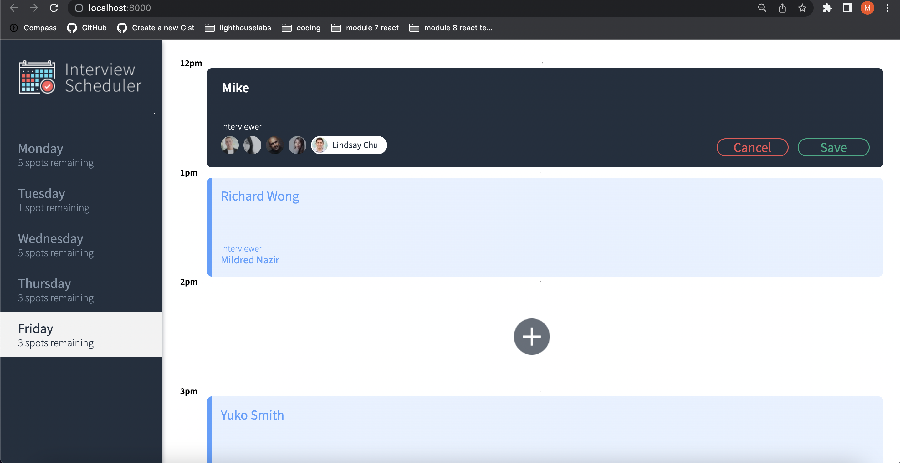
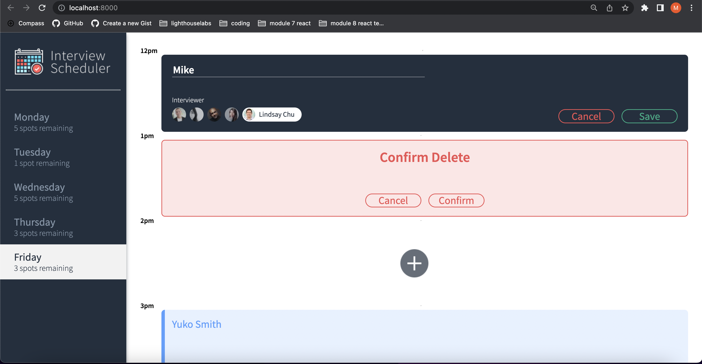

# Interview Scheduler

A webapp designed for learning react. You are able to book a interview using the plus sign on the page. Adding a student and selecting from a interviewer list. You can also edit or delete a interview booked.

## Setup

Install dependencies with `npm install`.

Dependencies include:

- axios: "^0.27.2"
- classnames: "^2.2.6"
- normalize.css: ^8.0.1"
- react: 16.14.0"
- react-dom: 16.9.0
- react-scripts: 3.0.0

## Scheduler Api terminal 1

- Fork and Clone (https://github.com/BMike84/scheduler-api) and follow instructions on readme.md
- Needs to be run in a seperate terminal

## Running Webpack Development Server terminal 2

```sh
npm start
```

## Running api

```sh
npm start
```

## Running Jest Test Framework

```sh
npm test
```

## Running Storybook Visual Testbed

```sh
npm run storybook
```

## Screenshots

Initial Page



Create Appointment



Delete Appointment


